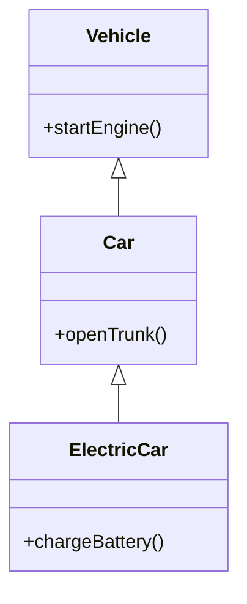
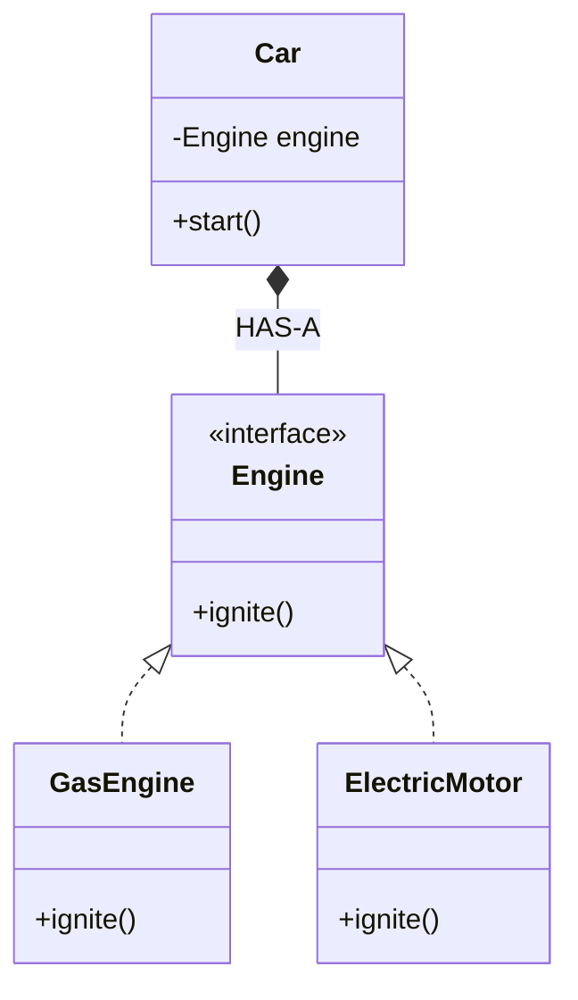

# Composition vs Inheritance

## Definition
This is one of the most important design debates in OOP. 
* **Inheritance** defines an **IS-A** relationship. A class derives its behavior by extending a parent class.
* **Composition** defines a **HAS-A** relationship. A class derives its behavior by containing instances of other classes that implement the desired functionality.

## Why It Exists
Historically, inheritance was the primary way to reuse code. Over time, engineers realized that deep inheritance trees become rigid and difficult to maintain. "Favor Composition over Inheritance" became a fundamental principle (as stated in the GoF Design Patterns book) to build more flexible, loosely coupled systems.

## Key Characteristics

### Inheritance (IS-A)
* Tightly coupled.
* Behavior is established at compile-time.
* Exposes parent's internals to the child class (via `protected`).
* Limited by single inheritance (in languages like Java).

### Composition (HAS-A)
* Loosely coupled.
* Behavior can be changed dynamically at run-time by swapping the composed object.
* Keeps internals hidden (black-box reuse).
* You can compose an object out of many different behaviors easily.

## Diagrams

### Inheritance Diagram (IS-A)

### Composition Diagram (HAS-A)

## Why Composition is Often Preferred
1. **Flexibility:** With composition, you can inject dependencies at runtime. A `Car` can be given an `ElectricEngine` or a `GasEngine` without needing to create new `ElectricCar` or `GasCar` classes.
2. **Avoiding the Diamond Problem:** Composition bypasses issues with multiple inheritance.
3. **No Unwanted Baggage:** When you inherit, you inherit *everything*. If you just want to use a few methods from a parent class, composition allows you to selectively expose only what you need.

## Industry Recommendations
* **Use Inheritance ONLY when:** There is a true, undeniable IS-A relationship, and the subclass is genuinely a specialized version of the superclass.
* **Use Composition when:** You want code reuse, you are building complex entities out of smaller parts, or you want to swap behaviors at runtime (Strategy Pattern).

## Summary
When designing systems, default to Composition. If you find yourself thinking "I'll extend this class so I can use its methods," stop. That is a code smell. Instead, inject that class as a private field (Composition) and call its methods.
