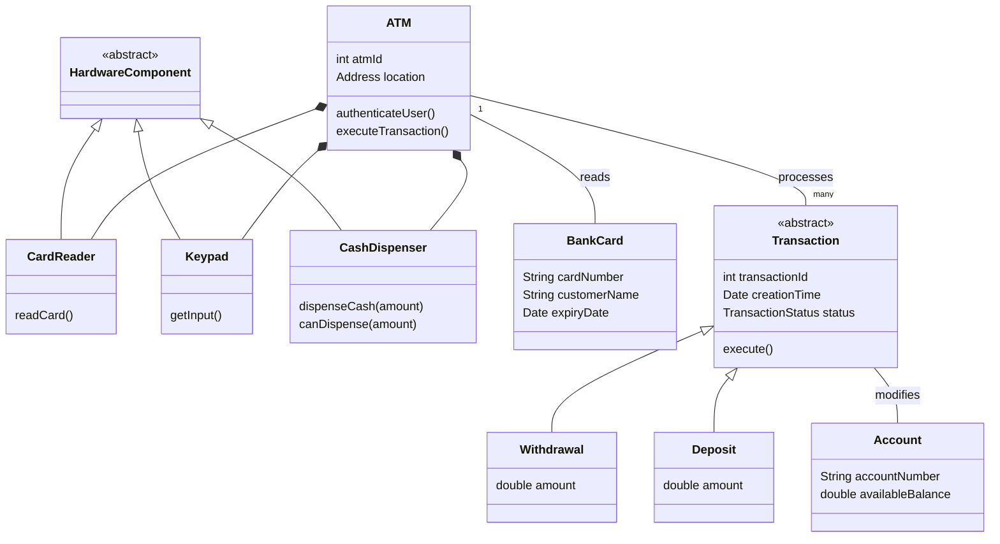

# ATM System - Object Modeling

## Problem Statement
Design the software for an Automated Teller Machine (ATM). A user should be able to insert a card, enter a PIN, and perform transactions such as checking their balance, withdrawing cash, and depositing checks. The ATM must communicate with the central bank to authorize transactions.

## Actors
* **Customer:** Uses the ATM to perform banking operations.
* **Bank Database (External System):** Authorizes PINs and processes account updates.
* **Operator:** Restocks the ATM with cash.

## Entities (Core Classes)
* **ATM:** The main machine managing hardware components.
* **CardReader:** Reads the debit card.
* **Keypad:** Accepts PIN and amount inputs.
* **CashDispenser:** Dispenses physical bills.
* **Screen:** Displays instructions to the user.
* **BankCard:** Represents the physical card.
* **Account:** The user's bank account (Checking or Savings).
* **Transaction:** Abstract base class for operations.
* **WithdrawalTransaction, DepositTransaction, BalanceInquiry:** Concrete transactions.

## Relationships
* An `ATM` HAS-A `CardReader`, `Keypad`, `CashDispenser`, and `Screen` (Composition).
* A `Customer` interacts with an `ATM` using a `BankCard`.
* An `ATM` creates `Transaction`s.
* A `Transaction` acts upon an `Account`.

## Simple Domain Diagram

