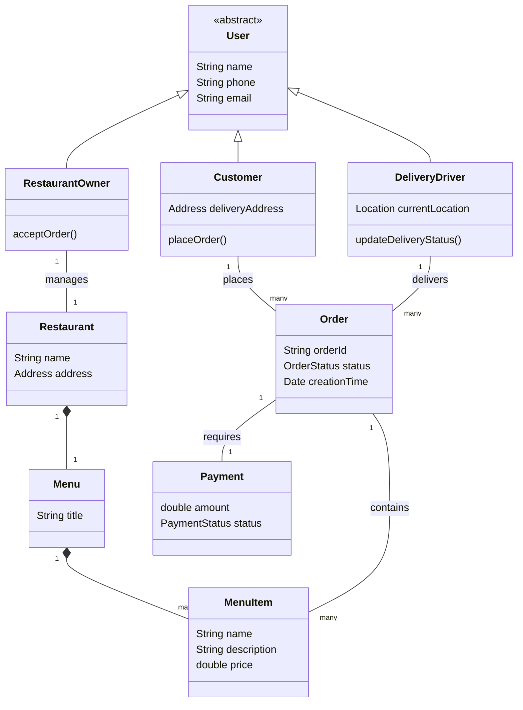

# Food Ordering System - Object Modeling

## Problem Statement
Design an application like DoorDash or UberEats. Users can browse restaurants, view menus, add items to a cart, and place an order. Restaurants receive the order and prepare the food. Delivery drivers pick up the food and deliver it to the user. The system must process payments and track order status.

## Actors
* **Customer:** Browses menus and places orders.
* **Restaurant Owner:** Updates menus and accepts/prepares orders.
* **Delivery Driver:** Picks up and delivers orders.

## Entities (Core Classes)
* **User:** Abstract base class for Customer, Owner, Driver.
* **Restaurant:** Represents the food establishment.
* **Menu:** A collection of MenuItems.
* **MenuItem:** A specific food item (e.g., "Cheeseburger").
* **Cart:** A temporary holding place for MenuItems before checkout.
* **Order:** The confirmed purchase.
* **Payment:** Transaction details.

## Relationships
* A `Restaurant` HAS-A `Menu`.
* A `Menu` HAS-MANY `MenuItem`s.
* A `Customer` creates an `Order`.
* An `Order` HAS-MANY `MenuItem`s.
* An `Order` is assigned to a `DeliveryDriver`.
* An `Order` HAS-A `Payment`.

## Simple Domain Diagram

