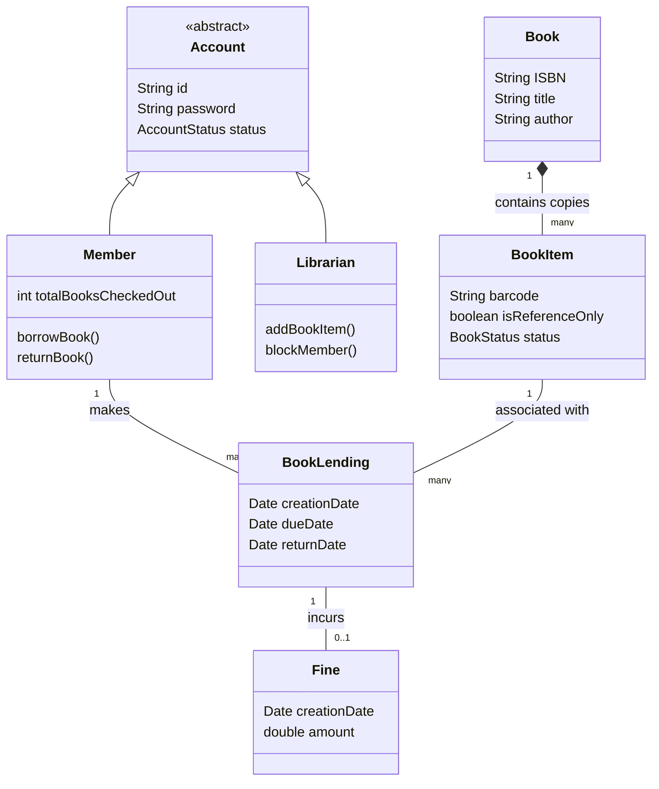

# Library Management System - Object Modeling

## Problem Statement
Design a system for a local library. Users can search for books by title or author. Users can borrow up to 5 books at a time. Books have a due date, and a fine is calculated if they are returned late. Librarians can add new books and register new members.

## Actors
* **Member:** Searches for books, borrows, and returns them.
* **Librarian:** Adds/removes books, registers members.
* **System:** Sends due date notifications, calculates fines.

## Entities (Core Classes)
* **Book:** Represents the physical or digital book.
* **BookItem:** A specific copy of a book (with a unique barcode).
* **Account:** Base class for users.
* **Member:** Subclass of Account.
* **Librarian:** Subclass of Account.
* **LibraryCard:** Associated with a Member.
* **BookLending:** A transaction record of a book being checked out.
* **Fine:** A record of money owed for a late return.

## Relationships
* A `Member` HAS-A `LibraryCard`.
* A `Book` HAS-MANY `BookItem`s (copies).
* A `Member` HAS-MANY `BookLending` records.
* A `BookLending` HAS-A `Fine` (if late).

## Simple Domain Diagram

