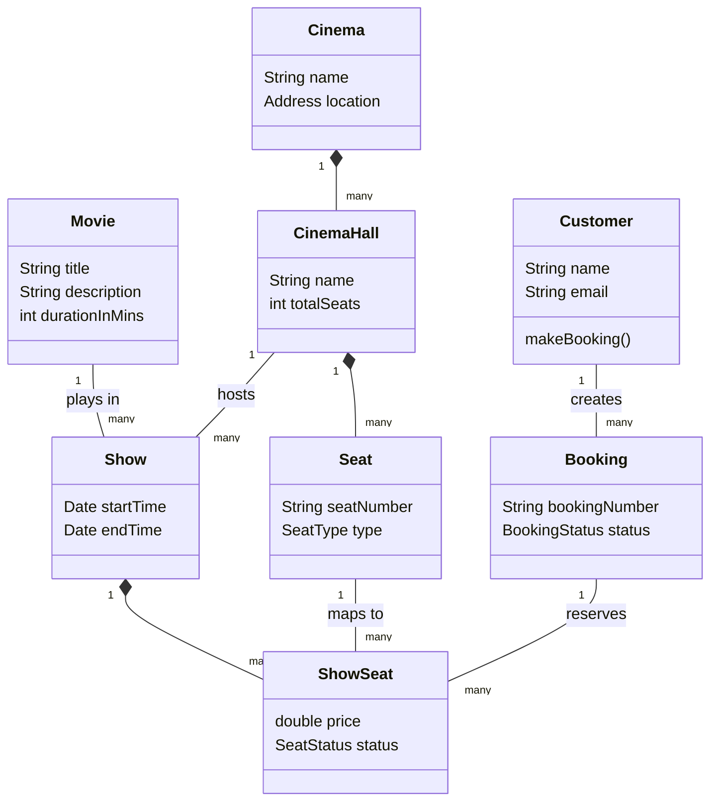

# Movie Booking System - Object Modeling

## Problem Statement
Design a movie ticket booking system like BookMyShow or Fandango. A user should be able to search for movies, view cinema halls showing the movie, select a specific showtime, choose their seats, and make a payment to book the tickets.

## Actors
* **Customer:** Searches for movies, selects seats, and pays.
* **Cinema Admin:** Adds movies, schedules shows, and configures seating layouts.
* **System:** Manages concurrency (preventing two people from booking the same seat).

## Entities (Core Classes)
* **Movie:** Information about the film (title, duration, genre).
* **Cinema:** A physical building (e.g., "AMC Times Square").
* **CinemaHall:** A specific screen/room within the cinema.
* **Show:** A specific screening of a movie at a specific time in a specific hall.
* **Seat:** A physical chair in a CinemaHall.
* **ShowSeat:** A seat for a *specific show* (tracks if it's booked or available).
* **Booking:** The reservation containing the selected seats.
* **Payment:** The transaction record.

## Relationships
* A `Cinema` HAS-MANY `CinemaHall`s.
* A `CinemaHall` HAS-MANY `Seat`s.
* A `Movie` is played in many `Show`s.
* A `Show` is hosted in a `CinemaHall`.
* A `Show` HAS-MANY `ShowSeat`s (instances of seats for that specific time).
* A `Customer` creates a `Booking`.
* A `Booking` HAS-MANY `ShowSeat`s and one `Payment`.

## Simple Domain Diagram

