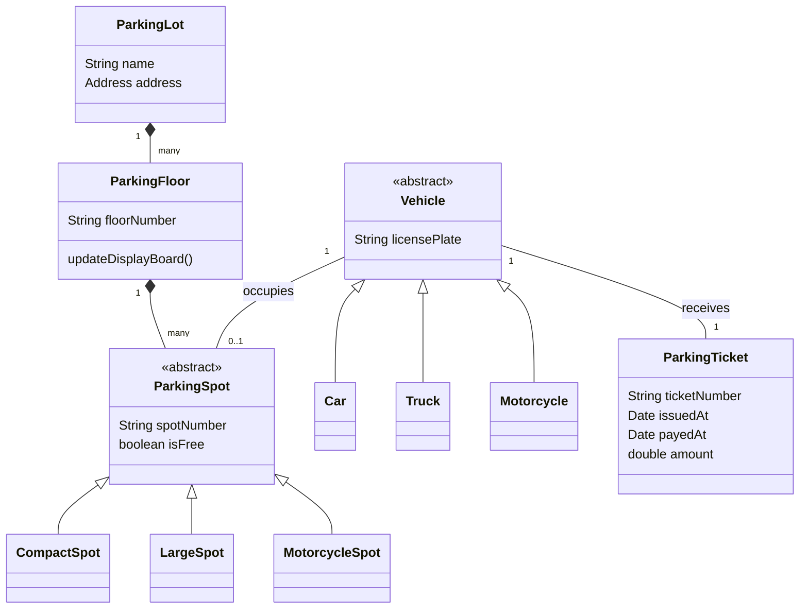

# Parking Lot - Object Modeling

## Problem Statement
Design a multi-level parking lot system. The parking lot should support different types of vehicles (motorcycles, compact cars, large trucks). It should issue a ticket upon entry and calculate the fee upon exit based on the duration of the stay.

## Actors
* **Customer:** Enters the lot, parks, and pays the exit fee.
* **System:** Manages spot allocation and calculates fees.
* **Admin:** Adds new floors or spots.

## Entities (Core Classes)
* **ParkingLot:** The main building.
* **ParkingFloor:** A specific level within the lot.
* **ParkingSpot:** Abstract base class for a space.
* **CompactSpot, LargeSpot, MotorcycleSpot:** Concrete spot types.
* **Vehicle:** Abstract base class for things that park.
* **Car, Truck, Motorcycle:** Concrete vehicle types.
* **ParkingTicket:** Issued upon entry, used for payment.
* **EntrancePanel:** hardware that issues tickets.
* **ExitPanel:** hardware that accepts payment.

## Relationships
* A `ParkingLot` HAS-MANY `ParkingFloor`s.
* A `ParkingFloor` HAS-MANY `ParkingSpot`s.
* A `Vehicle` occupies a `ParkingSpot`.
* An `EntrancePanel` issues a `ParkingTicket` for a `Vehicle`.

## Simple Domain Diagram

