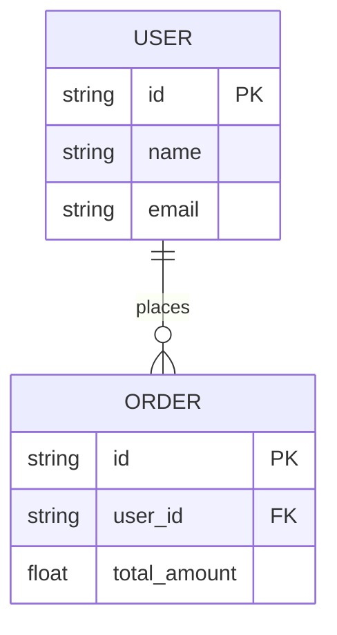

# Database Design Template

## Schema Overview
Provide a high-level explanation of the database strategy (SQL vs NoSQL, sharding, replication).

## ER Diagram

## Tables / Collections

### Table: `users`
Description of the users table.

| Column Name | Data Type | Constraints | Description |
| :--- | :--- | :--- | :--- |
| `id` | UUID | PRIMARY KEY | Unique user ID |
| `email` | VARCHAR(255) | UNIQUE, NOT NULL | User's email address |
| `created_at` | TIMESTAMP | DEFAULT CURRENT_TIMESTAMP | Record creation time |

### Table: `orders`
Description of the orders table.

| Column Name | Data Type | Constraints | Description |
| :--- | :--- | :--- | :--- |
| `id` | UUID | PRIMARY KEY | Unique order ID |
| `user_id` | UUID | FOREIGN KEY | Reference to user |
| `status` | VARCHAR(50) | NOT NULL | Order status |

## Indexes
* `idx_users_email` ON `users(email)`
* `idx_orders_user_id_status` ON `orders(user_id, status)`

## Partitioning / Sharding Strategy
Detail how data is distributed across multiple nodes if applicable.
