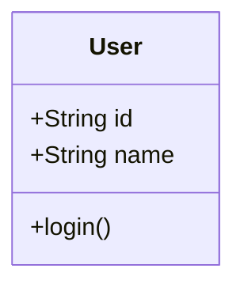
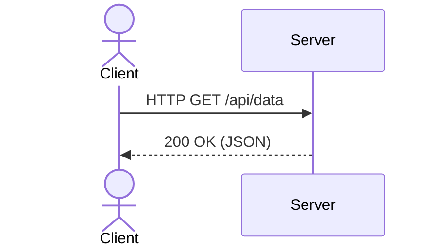

# [Project Name]

## Overview
Provide a brief overview of the project. What is the system/product? Why are we building it? Who are the target users?

## Problem Statement
Describe the core problem this design aims to solve. What are the pain points of the current system, or what gap does this new product fill?

## Functional Requirements
List the core features the system MUST support.
* **Requirement 1:** User can do X.
* **Requirement 2:** System should process Y.
* ...

## Non-Functional Requirements
Define the system's quality attributes (performance, scalability, reliability, etc.).
* **Availability:** e.g., 99.99% uptime.
* **Latency:** e.g., < 200ms response time.
* **Throughput:** e.g., 10,000 requests per second.
* **Consistency:** e.g., Eventual consistency for reads, strong consistency for financial transactions.
* **Scalability:** e.g., Ability to handle 10x traffic during peak events.

## Assumptions
List any assumptions made during the design process.
* e.g., Traffic is read-heavy (100:1 read/write ratio).
* e.g., Users will primarily access the system via mobile apps.

## Actors
Identify the different types of users or external systems that interact with the system.
* **Actor 1:** (e.g., Customer)
* **Actor 2:** (e.g., Admin)
* **System 1:** (e.g., Payment Gateway)

## Use Cases
Describe the main scenarios of how actors interact with the system.
1. Use case 1
2. Use case 2

## Domain Model
Describe the core entities and their relationships.
(You can use Mermaid class diagrams here if applicable).

## Class Diagram
Provide a detailed UML class diagram showcasing the internal structure of the system.

## Sequence Diagram
Illustrate the flow of messages between components for key use cases.

## Database Design
Describe the database schema. Include ER diagrams or schema definitions.

* **Table 1:** (e.g., `users`)
* **Table 2:** (e.g., `orders`)

## API Design
Document the RESTful or GraphQL endpoints exposed by the system.
* `GET /api/v1/resource`
* `POST /api/v1/resource`

## Design Patterns Used
List and explain the software design patterns utilized in this architecture.
* **Pattern 1:** (e.g., Factory Pattern for creating instances based on configuration)
* **Pattern 2:** (e.g., Strategy Pattern for different payment methods)

## Scalability Considerations
Explain how the system will scale to handle increased load.
* Caching strategies (Redis/Memcached)
* Database sharding/partitioning
* Load balancing
* Asynchronous processing (Message Queues like Kafka/RabbitMQ)

## Security Considerations
Detail how the system secures data and handles vulnerabilities.
* Authentication & Authorization (OAuth, JWT)
* Data encryption (at rest and in transit)
* Rate limiting & DDoS protection

## Trade-offs
Discuss the engineering compromises made during the design.
* e.g., Chose eventual consistency over strong consistency for better availability.
* e.g., Using NoSQL instead of SQL because of flexible schema requirements, trading off complex joins.

## Future Improvements
List potential enhancements or next steps for the system.
* ...

## References
Link to any articles, books, or documentation used as inspiration or reference.
* [Reference 1](url)
